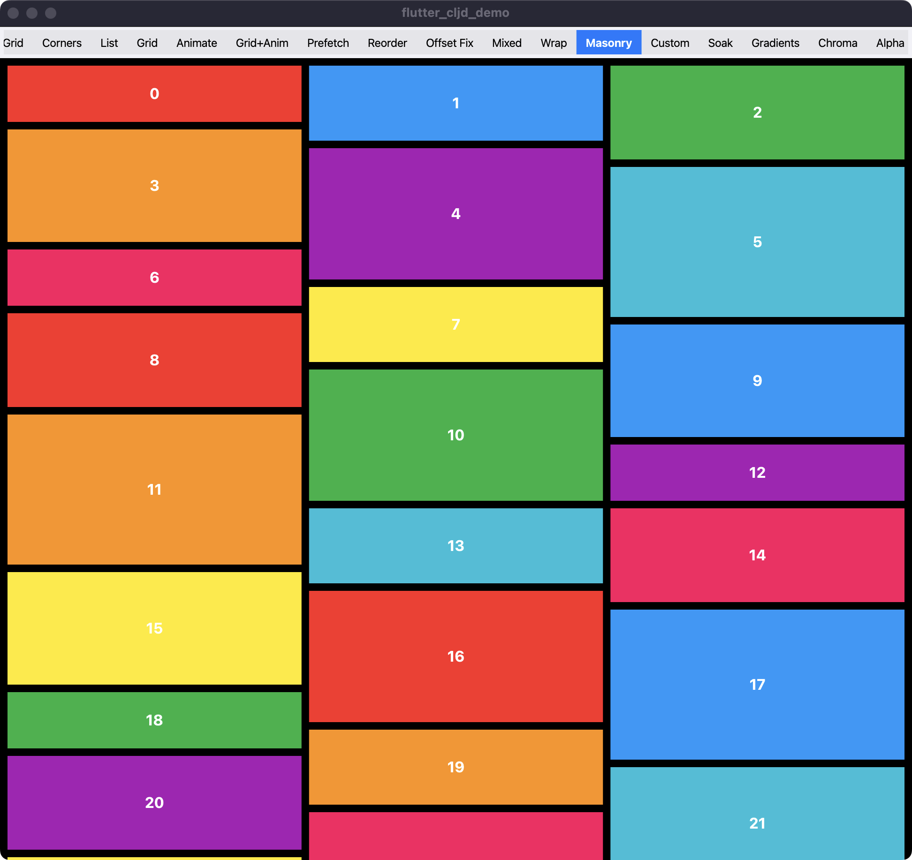

# flutter-cljd

[](https://github.com/dankinsoid/flutter-cljd/actions/workflows/ci.yml)
[](./LICENSE)


ClojureDart wrapper for Flutter Material widgets, designed to simplify and compact Flutter development in ClojureDart. It provides concise, Clojure-like syntax to work with Flutter’s Material components and types, making code more readable and expressive for Clojure developers building Flutter apps.

> **Status:** the API is alpha — names and signatures may still change between versions. The hand-written core is extensively tested (680+ commits, ~9k lines of tests — see [Testing](#testing)). The collection/grid subsystem is **experimental**: two known anchor defects are open (listed under Testing) and its test coverage is vertical-LTR only.



## Main Goals

### Provide a more concise and readable UI syntax
The library focuses on simplifying the syntax for building Flutter UIs, making it more compact, intuitive, and aligned with Clojure’s functional style.

### Use Clojure data structures for better consistency and flexibility
The API is designed around pure Clojure types instead of Dart’s, offering a more seamless and consistent experience for Clojure developers while increasing code flexibility.

### Streamline and enhance Dart APIs
The library simplifies certain Dart APIs, making them easier to use and more expressive, improving the overall developer experience.

## Installation

The library is distributed as a git dependency. In a [ClojureDart](https://github.com/Tensegritics/ClojureDart) Flutter project, add it to `deps.edn`:

```clojure
{:paths ["src"]
 :deps {tensegritics/clojuredart
        {:git/url "https://github.com/tensegritics/ClojureDart.git"
         :sha "81b5c03a55cf52b21dc0be8ccfa4827b9889f488"}
        com.github.dankinsoid/flutter-cljd
        {:git/url "https://github.com/dankinsoid/flutter-cljd.git"
         :sha "904a906d87704c08844911301e3af60fbbb41a78"}}
 :aliases {:cljd {:main-opts ["-m" "cljd.build"]}}
 :cljd/opts {:kind :flutter
             :main acme.main}}
```

### Starting from scratch

1. Install the [Flutter SDK](https://docs.flutter.dev/get-started/install) and the [Clojure CLI](https://clojure.org/guides/install_clojure).
2. Create a project directory with the `deps.edn` above and a `src/acme/main.cljd` entry point (see the [ClojureDart quick start](https://github.com/Tensegritics/ClojureDart/blob/main/doc/flutter-quick-start.md)).
3. Initialize and run:

```sh
clojure -M:cljd init
clojure -M:cljd flutter
```

Then require the library:

```clojure
(ns acme.main
  (:require [flutter-cljd.widgets :as ui]))
```

### Running the example app

The repository ships a gallery app under [`example/`](./example) showcasing the widgets, animations, and collection layouts:

```sh
git clone https://github.com/dankinsoid/flutter-cljd.git
cd flutter-cljd
make repl              # runs the example on macOS with hot reload
# or: make repl DEVICE=chrome
```

## Examples

```clojure
;; Basic button with styling
(->> (text "Click me!")
     (with-text-style :color :blue, :size 16)
     (padding :h 16 :v 8)
     (button #(println "Clicked!")))
```
```clojure
;; Card with multiple elements
(->> (row :spacing 10
       (text "Title" :size 20, :weight :bold)
       (text "Subtitle" :color :grey))
     (padding 16)
     (card :elevation 2 :radius 8))
```

### Styling and Layout
```clojure
;; Applying styles and layouts
(->> (text "Styled Text")
     (with-text-style :color :blue
                      :size 20
                      :weight :bold)
     (padding 16)
     (center))

;; Responsive layouts
(->> (column :spacing 8
       (text "Header")
       (expanded
         (list
           (for [i (range 10)]
             (text (str "Item " i)))))
       (text "Footer"))
     (container :color :white))
```

### Interactive Components
```clojure
;; Button with feedback
(->> (text "Click Me!")
     (button #(println "Clicked!")
             {:on-long-press #(println "Long pressed!")
              :on-hover #(println "Hover: " %)}))

;; Form elements
(let [controller (atom "")]
  (->> (text-field
         {:controller controller
          :on-changed #(reset! controller %)
          :decoration {:label "Enter text"}})
       (padding 16)))
```

### Complete Example
```clojure
(ns readme.example
  (:require [flutter-cljd.widgets :as ui]))

;; User profile card
(defn profile-card [& {:keys [name role avatar]}]
  (->> (ui/row
         ;; Avatar section
         (->> avatar
              (ui/circle :size 40)
              (ui/padding :right 12))
         
         ;; Text content
         (ui/column :spacing 10
           (ui/text name :size 18, :weight :bold)
           (ui/text role :size 14)))
       (ui/with-text-style :color :grey)
       (ui/padding 16)
       (ui/card :elevation 4 :radius 12)
       (ui/center)))

;; Usage example
(def user-profile
  (profile-card
     :name "John Doe"
     :role "Senior Developer"
     :avatar (ui/image "path/to/avatar.png")))
```

## Documentation

Beyond the widget wrappers, the library ships several extensions to Flutter, each with in-depth documentation:

- [Animations](./docs/Animations.md) — declarative animation system combining motion descriptions with flexible widget animations.
- [Button](./docs/Button.md) — universal button with minimal default styling and full control over appearance via modifiers.
- [Collection Rect Animator](./docs/CollectionRectAnimator.md) — design of the unified keyed animator that drives insert/move/resize transitions in collection layouts (experimental subsystem, see [Testing](#testing)).
- [Collection Testing](./docs/CollectionTesting.md) — how the virtualization engine is verified: a `RenderViewport` simulation harness, an invariant oracle battery, and a seeded fuzzer.

## Testing

The suite is ~9k lines of hand-written tests (generated Dart excluded from every count here):

- a real-widget harness that mounts the public widgets under `testWidgets`, with an invariant-oracle battery for the collection virtualization engine;
- a deterministic seeded fuzzer over random operation sequences, with shrinking of failing episodes;
- deterministic reproduction suites for previously found issues — `:known-red` tags the open ones;
- dedicated tests for the grid layout solver, geometry, types, widgets, borders, and animations.

Coverage is currently **vertical-LTR**: horizontal axes, `:reverse`, and RTL are not systematically exercised.

Known open defects in the experimental collection/grid subsystem (both tagged `:known-red`):

- **NEW-16** — a morph into a denser layout can re-anchor onto the capture window's first child instead of the item the user was looking at (~115px off after the transition).
- **NEW-17** — an insert above the window while resting on `maxScrollExtent` drifts the anchor's consumed fraction by ~6px on masonry (untraced).

```sh
clojure -M:cljd test -- -x "known-red || fuzz"   # the green baseline
clojure -M:cljd test -- -t fuzz --timeout 20x    # the fuzz campaign
make check                                       # compile the example + dart analyze
```

See [Collection Testing](./docs/CollectionTesting.md) for the methodology. CI runs the green baseline on every push and pull request, plus a non-blocking full fuzz job.

## Contributing

Contributions are welcome. For major changes, please open an issue first to discuss the proposed direction.

- Follow the existing code style.
- Add tests for new features; run `make test` and `make check` before submitting.
- Update documentation as needed.
- Keep commits focused and atomic, with clear commit messages.

## License

This project is licensed under the MIT License — see the [LICENSE](./LICENSE) file for details.
